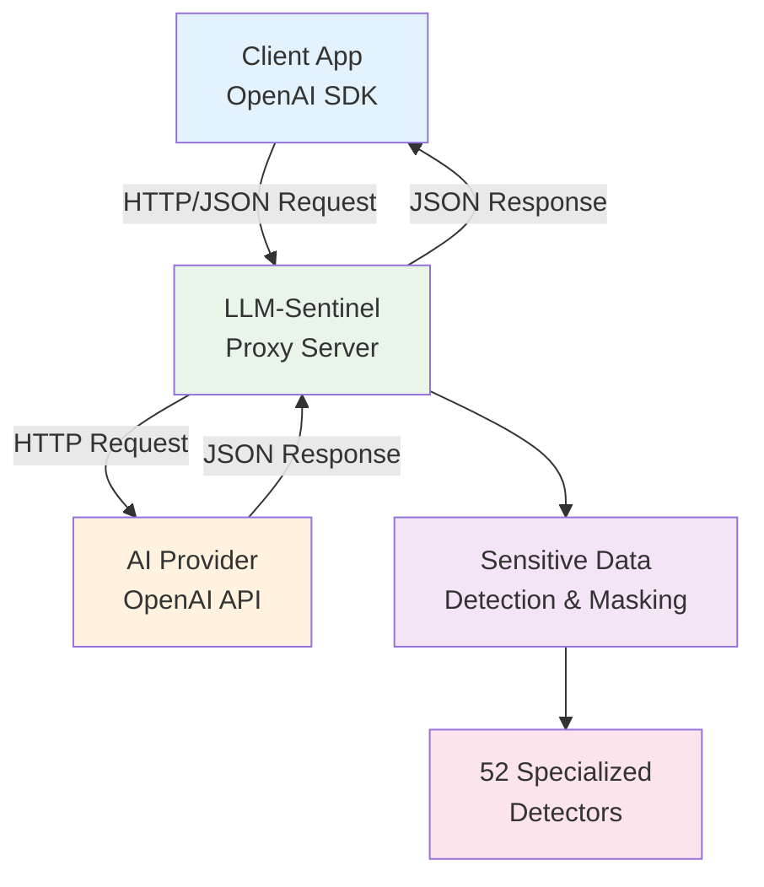

# Development Guide

This guide covers the technical aspects of developing LLM-Sentinel, including architecture, setup, and implementation details.

## Table of Contents

- [Development Setup](#development-setup)
- [Project Architecture](#project-architecture)
- [Core Components](#core-components)
- [Adding New Detectors](#adding-new-detectors)
- [Configuration System](#configuration-system)
- [Proxy Implementation](#proxy-implementation)
- [CLI System](#cli-system)
- [Logging System](#logging-system)
- [Testing Strategy](#testing-strategy)
- [Build and Deployment](#build-and-deployment)

## Development Setup

### Prerequisites

- **Node.js** 18 or later
- **npm** 8 or later
- **TypeScript** knowledge
- **Git** for version control

### Quick Setup

```bash
# Clone the repository
git clone https://github.com/raaihank/llm-sentinel.git
cd llm-sentinel

# Install dependencies
npm install

# Start development server with hot reload
npm run dev

# In another terminal, test the proxy
curl http://localhost:5050/health
```

### Development Scripts

```bash
npm run dev          # Hot reload development server
npm run build        # Build for production
npm run typecheck    # Type checking without build
npm run clean        # Remove build artifacts
npm start           # Run built application
npm run lint        # Code linting (if configured)
```

### Development Workflow

1. **Start development server**: `npm run dev`
2. **Make changes** to source files in `src/`
3. **Server auto-restarts** on file changes
4. **Test manually** with curl or HTTP clients
5. **Build and test** before committing: `npm run build && npm start`

### IDE Setup

**VS Code Extensions** (recommended):
- TypeScript and JavaScript Language Features
- ESLint
- Prettier
- REST Client (for testing APIs)

**TypeScript Configuration**:
The project uses strict TypeScript settings in `tsconfig.json`:
```json
{
  "compilerOptions": {
    "strict": true,
    "noImplicitAny": true,
    "noImplicitReturns": true,
    "noUnusedLocals": true
  }
}
```

## Project Architecture

### High-Level Overview



### Core Flow

1. **Request Interception**: Express server receives API requests
2. **Content Extraction**: Parse request body and extract text content
3. **Sensitive Data Detection**: Run 52 detection rules against content
4. **Data Masking**: Replace sensitive data with safe placeholders
5. **Request Forwarding**: Proxy modified request to target AI service
6. **Response Handling**: Forward response back to client
7. **Logging**: Record detection events (privacy-safe)

### Directory Structure

```
llm-sentinel/
├── src/
│   ├── cli.ts              # Command line interface entry point
│   ├── proxy-server.ts     # HTTP proxy server implementation
│   ├── detectors.ts        # Detection rules and masking logic
│   ├── config.ts           # Configuration management
│   ├── logger.ts           # Structured logging system
│   ├── commands.ts         # CLI command implementations
│   └── types/              # TypeScript type definitions
├── dist/                   # Compiled JavaScript output
├── docs/                   # Documentation files
├── logs/                   # Runtime log files
├── config.sample.json      # Sample configuration file
├── package.json            # Project dependencies and scripts
├── tsconfig.json           # TypeScript compiler configuration
└── Dockerfile              # Container build configuration
```

## Core Components

### 1. Proxy Server (`proxy-server.ts`)

The HTTP proxy server built with Express.js that intercepts API requests:

```typescript
import express from 'express';
import { createProxyMiddleware } from 'http-proxy-middleware';

// Core proxy setup
const app = express();

// OpenAI proxy endpoint
app.use('/openai', createProxyMiddleware({
  target: 'https://api.openai.com',
  changeOrigin: true,
  pathRewrite: { '^/openai': '' },
  onProxyReq: (proxyReq, req, res) => {
    // Intercept and modify request
    const maskedContent = maskSensitiveData(req.body);
    // Forward modified request
  }
}));
```

**Key Features**:
- Request/response interception
- JSON body parsing and modification
- Header passthrough (except sensitive ones)
- Error handling and logging
- Health check endpoint

### 2. Sensitive Data Detector (`detectors.ts`)

The detection engine with 52 specialized rules:

```typescript
interface MaskingRule {
  name: string;           // Rule identifier
  pattern: RegExp;        // Detection regex pattern
  replacement: string | ((match: string, ...groups: string[]) => string);  // Replacement placeholder or function
}

class SensitiveDataDetector {
  private rules: MaskingRule[];
  
  constructor() {
    this.rules = this.getDefaultRules();
  }
  
  public mask(text: string): [string, Array<{entityType: string, masked: string, count: number}>] {
    // Apply all rules and return masked content + detection metadata
  }
}
```

**Rule Categories**:
- **api-keys**: API keys and tokens
- **personal**: PII like emails, phones, SSNs
- **credentials**: Database URLs, private keys
- **cloud**: AWS, Azure, GCP credentials
- **financial**: Credit cards, account numbers

### 3. Configuration System (`config.ts`)

Manages application configuration with defaults and validation:

```typescript
interface LLMSentinelConfig {
  server: {
    port: number;
    openaiTarget: string;
    ollamaTarget: string;
  };
  detection: {
    enabled: boolean;
    enabledRules: string[];
    customRules: Array<{
      name: string;
      pattern: string;
      replacement: string;
      enabled: boolean;
    }>;
  };
  logging: {
    showDetectedEntity: boolean;
    showMaskedValue: boolean;
    showOccurrenceCount: boolean;
    logToConsole: boolean;
    logToFile: boolean;
    logLevel: 'DEBUG' | 'INFO' | 'WARN' | 'ERROR';
    truncatePayload: boolean;
    maxPayloadLogLength: number;
  };
  notifications: {
    enabled: boolean;
    showEntityType: boolean;
    showCount: boolean;
    sound: boolean;
  };
  security: {
    redactApiKeys: boolean;
    redactCustomHeaders: string[];
  };
}

// Configuration loading priority:
// 1. Command line arguments
// 2. Environment variables
// 3. Config file (~/.llm-sentinel/config.json)
// 4. Built-in defaults
```

### 4. CLI System (`cli.ts`, `commands.ts`)

Command-line interface built with Commander.js:

```typescript
import { Command } from 'commander';

const program = new Command();

program
  .name('llmsentinel')
  .description('Privacy-first proxy for AI APIs')
  .version('1.0.0');

program
  .command('start')
  .option('-p, --port <port>', 'server port', '5050')
  .option('-d, --daemon', 'run as daemon')
  .action(startServer);

program
  .command('status')
  .description('check server status')
  .action(checkStatus);
```

**Available Commands**:
- Server management: `start`, `stop`, `restart`, `status`
- Configuration: `port`, `rules`, `config`
- Debugging: `debug`, `no-debug`, `logs`

## Adding New Detectors

### Step 1: Define the Detection Rule

Add to `detectors.ts`:

```typescript
const newServiceApiKey: MaskingRule = {
  name: 'newServiceApiKey',
  pattern: /ns_[a-zA-Z0-9]{32}/g,  // Service-specific pattern
  replacement: '[NEW_SERVICE_API_KEY_MASKED]'
};
```

### Step 2: Research the Pattern

**API Key Format Research**:
1. Check service documentation
2. Examine real examples (use dummy/test keys only)
3. Identify consistent patterns and variations
4. Test with regex101.com

**Common API Key Patterns**:
```typescript
// Fixed prefix + random chars
/sk-[a-zA-Z0-9]{48}/g                    // OpenAI
/sk-ant-[a-zA-Z0-9-_]{95}/g             // Anthropic
/AKIA[0-9A-Z]{16}/g                      // AWS Access Key

// Service identifier + delimiter + key
/Bearer\s+[a-zA-Z0-9-_]{40,}/g          // Generic Bearer tokens
/token:\s*[a-zA-Z0-9]{32}/g             // Generic token format

// Complex formats
/https:\/\/.*:.*@.*\/.*$/g               // Database URLs with credentials
```

### Step 3: Add to Rules Array

```typescript
// In detectors.ts - add to the rules array in getDefaultRules() method
private getDefaultRules(): MaskingRule[] {
  return [
    // ... existing rules
    newServiceApiKey,
    // Keep alphabetically sorted for maintainability
  ];
}
```

### Step 4: Update Default Configuration

Add to the default enabled rules in `config.ts`:

```typescript
const defaultEnabledRules = [
  // ... existing rules
  'newServiceApiKey',
];
```

### Step 5: Add Tests

```typescript
describe('New Service API Key Detection', () => {
  test('should detect and mask new service API keys', () => {
    const input = 'My API key is ns_abcd1234567890abcdef1234567890ab';
    const detector = new SensitiveDataDetector();
    const [maskedText, findings] = detector.mask(input);
    
    expect(maskedText).toBe('My API key is [NEW_SERVICE_API_KEY_MASKED]');
    expect(findings).toHaveLength(1);
    expect(findings[0].entityType).toBe('newServiceApiKey');
  });

  test('should handle multiple keys', () => {
    const input = 'Keys: ns_key1111111111111111111111111111 and ns_key2222222222222222222222222222';
    const detector = new SensitiveDataDetector();
    const [maskedText, findings] = detector.mask(input);
    
    expect(findings).toHaveLength(1);
    expect(findings[0].count).toBe(2);
  });

  test('should not match invalid patterns', () => {
    const input = 'Not a key: ns_short or random_ns_middle_text';
    const detector = new SensitiveDataDetector();
    const [maskedText, findings] = detector.mask(input);
    
    expect(findings).toHaveLength(0);
  });
});
```

### Step 6: Update Documentation

1. Add to README.md detector count and list
2. Add to sample configuration file
3. Update CONTRIBUTING.md with example

## Configuration System

### Configuration Loading

```typescript
// 1. Load defaults
const defaultConfig: Config = { /* ... */ };

// 2. Load from config file
const configFile = path.join(os.homedir(), '.llm-sentinel', 'config.json');
const fileConfig = loadConfigFile(configFile);

// 3. Apply environment variables
const envConfig = loadFromEnvironment();

// 4. Apply CLI arguments
const cliConfig = parseCliArguments();

// 5. Merge with precedence: CLI > ENV > FILE > DEFAULTS
const finalConfig = merge(defaultConfig, fileConfig, envConfig, cliConfig);
```

### Configuration Validation

```typescript
function validateConfig(config: unknown): Config {
  // Type validation
  if (typeof config !== 'object' || config === null) {
    throw new Error('Config must be an object');
  }

  // Port validation
  if (config.server?.port && !isValidPort(config.server.port)) {
    throw new Error('Port must be between 1 and 65535');
  }

  // Rule validation
  if (config.detection?.enabledRules) {
    validateRuleNames(config.detection.enabledRules);
  }

  return config as Config;
}
```

### Dynamic Configuration Updates

```typescript
// CLI commands can update config
export function updateConfiguration(updates: Partial<Config>): void {
  const currentConfig = loadConfiguration();
  const newConfig = merge(currentConfig, updates);
  
  validateConfig(newConfig);
  saveConfiguration(newConfig);
  
  // Notify running server of config changes
  notifyConfigChange(newConfig);
}
```

## Proxy Implementation

### Request Processing Pipeline

```typescript
async function processRequest(req: express.Request): Promise<ModifiedRequest> {
  // 1. Parse request body
  const body = await parseRequestBody(req);
  
  // 2. Extract text content from various formats
  const textContent = extractTextContent(body);
  
  // 3. Apply detection and masking
  const maskingResult = maskSensitiveData(textContent);
  
  // 4. Reconstruct request with masked content
  const modifiedBody = replaceTextContent(body, maskingResult.maskedContent);
  
  // 5. Log detection events
  logDetectionEvent(maskingResult);
  
  // 6. Return modified request
  return {
    ...req,
    body: modifiedBody,
    detectionMetadata: maskingResult
  };
}
```

### Content Extraction Strategies

```typescript
function extractTextContent(body: any): string {
  if (typeof body === 'string') {
    return body;
  }
  
  if (body.messages) {
    // OpenAI chat format
    return body.messages
      .map((msg: any) => msg.content)
      .join(' ');
  }
  
  if (body.prompt) {
    // Ollama/completion format
    return body.prompt;
  }
  
  // Generic object - extract all string values
  return extractAllStrings(body).join(' ');
}
```

### Error Handling

```typescript
app.use((error: Error, req: express.Request, res: express.Response, next: express.NextFunction) => {
  logger.error('Proxy error', { error: error.message, path: req.path });
  
  // Don't leak internal errors to clients
  res.status(500).json({
    error: 'Internal proxy error',
    requestId: generateRequestId()
  });
});
```

## CLI System

### Command Structure

```typescript
// Base command setup
const program = new Command()
  .name('llmsentinel')
  .description('Privacy-first proxy for AI APIs')
  .version(getVersion());

// Subcommands with shared options
program
  .command('start')
  .description('start the proxy server')
  .option('-p, --port <port>', 'server port', '5050')
  .option('-d, --daemon', 'run as daemon process')
  .action(handleStartCommand);

// Configuration commands
program
  .command('port <port>')
  .description('set server port')
  .action(handlePortCommand);
```

### Process Management

```typescript
// PM2 integration for daemon mode
import pm2 from 'pm2';

async function startDaemon(options: StartOptions): Promise<void> {
  return new Promise((resolve, reject) => {
    pm2.connect((err) => {
      if (err) return reject(err);
      
      pm2.start({
        name: 'llm-sentinel',
        script: path.join(__dirname, 'cli.js'),
        args: ['start', '--port', options.port],
        instances: 1,
        autorestart: true
      }, (err) => {
        pm2.disconnect();
        err ? reject(err) : resolve();
      });
    });
  });
}
```

## Logging System

### Structured Logging

```typescript
interface LogEntry {
  timestamp: string;
  level: 'DEBUG' | 'INFO' | 'WARN' | 'ERROR';
  message: string;
  requestId?: string;
  sensitiveDataDetection?: {
    sensitiveDataFound: boolean;
    detectedEntities: DetectionEvent[];
  };
}

class Logger {
  log(level: LogLevel, message: string, metadata?: any): void {
    const entry: LogEntry = {
      timestamp: new Date().toISOString(),
      level,
      message,
      ...this.sanitizeMetadata(metadata)
    };
    
    // Write to file and/or console
    this.writeLog(entry);
  }
  
  private sanitizeMetadata(metadata: any): any {
    // Remove sensitive data from log metadata
    return sanitizeObject(metadata);
  }
}
```

### Privacy-Safe Detection Logging

```typescript
function logDetectionEvent(result: MaskingResult, config: Config): void {
  const logEntry = {
    sensitiveDataFound: result.detections.length > 0,
    detectedEntities: result.detections.map(detection => ({
      // Hide actual entity type in secure mode
      entityType: config.logging.showDetectedEntity 
        ? detection.entityType 
        : '[ENTITY_TYPE_HIDDEN]',
      maskedAs: detection.replacement,
      occurrences: detection.occurrences
    }))
  };
  
  logger.info('Request processed', { sensitiveDataDetection: logEntry });
}
```

## Testing Strategy

### Unit Tests

```typescript
// Test individual detection rules
describe('Email Detection', () => {
  test('detects various email formats', () => {
    const testCases = [
      'user@domain.com',
      'user.name@domain.co.uk',
      'user+tag@domain-name.org'
    ];
    
    testCases.forEach(email => {
      const result = maskSensitiveData(`Email: ${email}`);
      expect(result.detections).toHaveLength(1);
      expect(result.maskedContent).toContain('[EMAIL_MASKED]');
    });
  });
});
```

### Integration Tests

```typescript
// Test full proxy functionality
describe('Proxy Integration', () => {
  let server: express.Application;
  
  beforeEach(() => {
    server = createProxyServer({ port: 0 });
  });
  
  test('masks sensitive data in OpenAI requests', async () => {
    const response = await request(server)
      .post('/openai/v1/chat/completions')
      .send({
        model: 'gpt-3.5-turbo',
        messages: [{
          role: 'user',
          content: 'My API key is sk-test123456789'
        }]
      });
    
    expect(response.body.messages[0].content)
      .toContain('[OPENAI_API_KEY_MASKED]');
  });
});
```

### Performance Tests

```typescript
// Test detection performance with large inputs
describe('Performance', () => {
  test('processes large requests within acceptable time', () => {
    const largeText = 'some text '.repeat(10000);
    const start = Date.now();
    
    maskSensitiveData(largeText);
    
    const duration = Date.now() - start;
    expect(duration).toBeLessThan(1000); // < 1 second
  });
});
```

## Build and Deployment

### TypeScript Compilation

```json
// tsconfig.json
{
  "compilerOptions": {
    "target": "ES2020",
    "module": "commonjs",
    "outDir": "./dist",
    "rootDir": "./src",
    "strict": true,
    "esModuleInterop": true,
    "resolveJsonModule": true
  },
  "include": ["src/**/*"],
  "exclude": ["node_modules", "dist", "**/*.test.ts"]
}
```

### Docker Build Process

```dockerfile
# Multi-stage build for optimal size
FROM node:20-alpine AS builder
WORKDIR /app
COPY package*.json tsconfig.json ./
COPY src/ ./src/
RUN npm ci && npm run build

FROM node:20-alpine AS production
RUN adduser -S llmsentinel
WORKDIR /app
COPY --from=builder /app/dist ./dist
COPY package*.json ./
RUN npm ci --only=production
USER llmsentinel
CMD ["node", "dist/cli.js", "start"]
```

### Release Process

```bash
# 1. Update version
npm version patch  # or minor/major

# 2. Build and test
npm run build
npm run typecheck
npm test

# 3. Docker build and push
docker build -t raaihank/llm-sentinel:latest .
docker push raaihank/llm-sentinel:latest

# 4. NPM publish
npm publish

# 5. GitHub release
git push --tags
```

### Performance Optimization

**Regex Optimization**:
- Use non-capturing groups: `(?:...)` instead of `(...)`
- Anchor patterns when possible: `^` and `$`
- Avoid backtracking: be specific with quantifiers

**Memory Management**:
- Stream large requests instead of buffering
- Limit request body size
- Clean up detection results after processing

**Caching**:
- Cache compiled regex patterns
- Reuse configuration objects
- Cache detection rule lookups

## Debugging and Troubleshooting

### Debug Mode

```bash
# Enable debug logging
llmsentinel debug

# View detailed logs
llmsentinel logs -n 100

# Test specific detection
echo "test data" | llmsentinel test-detection
```

### Common Issues

1. **Port conflicts**: Check if port is already in use
2. **Permission errors**: Ensure write access to log directory
3. **Configuration errors**: Validate JSON syntax in config file
4. **Proxy timeouts**: Check target service connectivity

### Monitoring

```typescript
// Health check endpoint
app.get('/health', (req, res) => {
  res.json({
    status: 'healthy',
    uptime: process.uptime(),
    memory: process.memoryUsage(),
    version: getVersion()
  });
});

// Metrics endpoint
app.get('/metrics', (req, res) => {
  res.json({
    requestsProcessed: getRequestCount(),
    detectionsTotal: getDetectionCount(),
    averageLatency: getAverageLatency()
  });
});
```

This development guide provides the technical foundation for understanding and extending LLM-Sentinel. For contributing guidelines and workflow, see [CONTRIBUTING.md](CONTRIBUTING.md).